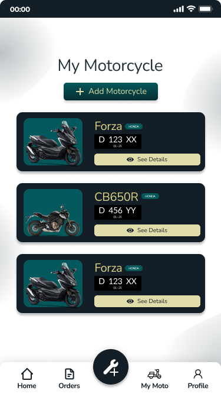
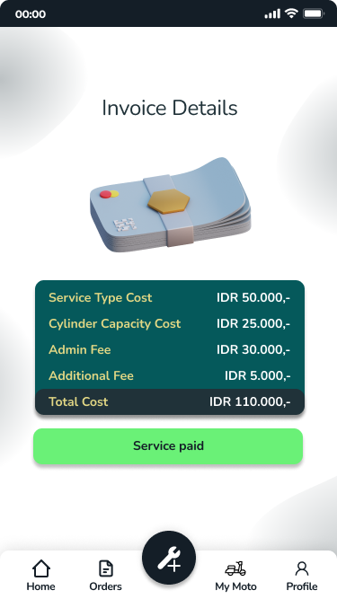

# Fixcycle

Fixcycle is Android-based mobile application that helps motorcycle repair shops to process service orders online. With this application, users can save their motorcycle info, book a service of their owned motorcycle, view orders based on their status, and view invoices of their finished service. On the other hand, admin can accept or reject the service booked by the user and finish the service when the service is done.

Download the app here: https://bit.ly/fixcycle-apk

## About
This is the frontend side repository.
Check out the backend side here: https://github.com/rahmatsyifana12/fixcycle-be/

## Features
* Login & Registration System
* Pick Up and Drop
* Balance Top Up
* Motorcycle List
* Motorcycle Details
* Service Booking
* Service List
* Service Details
* Live Order Status
* Admin Side Order
* Invoice Details
* Responsive Layout

## Technology
* Java
* XML

## Preview

